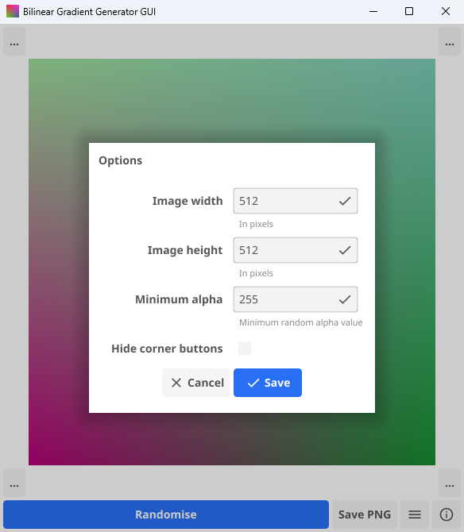

# Bilinear gradient generator GUI

Uses bilinear-interpolation to generate random colour gradients. A random value is selected for each corner of the image, then bilinear-interpolation is used to interpolate the remaining pixels. This is repeated 3 times. These 3 separate pixel arrays are then combined into the red, green and blue channels to produce a final image.

Based *very* heavily on [Bilinear gradient generator](https://github.com/odddollar/Bilinear-gradient-generator).

## Screenshots

